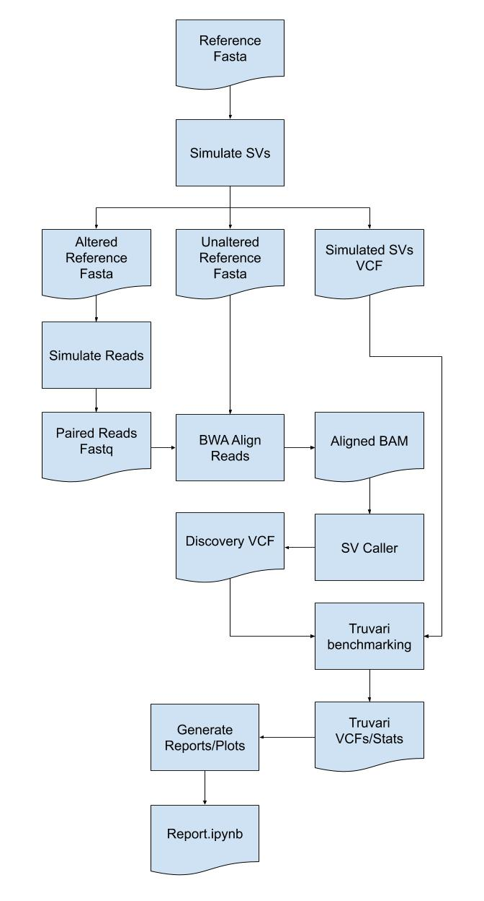

# SVTeaser

SV simulation for rapid benchmarking

[Previous Work](https://genomebiology.biomedcentral.com/articles/10.1186/s13059-015-0803-1)

[Hackathon Schedule](https://docs.google.com/document/d/1ychEMq4vXWtMQRGJD4re5ZzEyIDpb5o_cSBy3CPv2hg/edit#heading=h.5g50ovsn2k70)


## Goals

Make a tool that performs SV and read simulation to create inputs for benchmarking an SV caller. Create an evaluation/reporting procedure of the SV callers’ performance.


## Overview Diagram





## Working Notes/Documentation

[Here](https://docs.google.com/document/d/1AQxiYEbBhN0-HCAOsrqHZxvsh4ZIFxxeVoJGxApmG-U/edit#)

# File structure diagram 
#### _Define paths, variable names, etc_

## Installation

- Build the SVTeaser pip install-able tarball
- Download and install [SURVIVOR](https://github.com/fritzsedlazeck/SURVIVOR.git)
- Put the `SURVIVOR` executable into your environment's PATH
- Install [vcftools](https://vcftools.github.io/index.html)
- Ensure `vcftools` (e.g. `vcf-sort`) is in your environment's PATH

The three steps of this are handled by `bash install.sh`

## Quick Start

```
usage: svteaser [-h] CMD ...

SVTeaser v0.0.1 - SV simulation for rapid benchmarking

    CMDs:
        sim_sv          Simulate SVs
        surv_sim        Simulate SVs with SURVIVOR
        surv_vcf_fmt    Correct a SURVIVOR simSV vcf
        sim_reads       Run read simulators

positional arguments:
  CMD         Command to execute
  OPTIONS     Options to pass to the command

optional arguments:
  -h, --help  show this help message and exit
```

Workflow:

* Create a SVTeaser working directory (`output.svt`) by simulating SVs over a reference
- `svteaser surv_sim reference.fasta workdir`
2. _in progress_ Simulate reads over the altered reference and place them in the `output.svt` directory
- `svteaser sim_reads workdir.svt`
3. Call SVs over the reads (`output.svt/read1.fastq output.svt/read2.fastq`) with your favorite SV caller
4. Run `truvari bench` with the `--base output.svt/simulated.sv.vcf.gz` and `--comp your_calls.vcf.gz`
5. Open the `notebooks/SVTeaser.ipynb` and point to your `output.svt` directory

See `test/workflow_test.sh` for an example

## Component Details

### SV Simulator
Two methods for SV simulation are supported in `SVTeaser` - (_done_) simulation of SV with `SURVIVOR`
and (_in progress_) simulation of SVs from VCFs.

Running simulation in either mode results in an output directory of the following structure -
```
$ svteaser surv_sim reference.fasta workdir
$ ll -h workdir
total 2.3M
drwxr-xr-x  2 user hardware 4.0K Oct 12 15:38 ./
drwxr-xr-x 13 user hardware 4.0K Oct 12 15:38 ../
-rw-r--r--  1 user hardware 1.1M Oct 12 15:38 svteaser.altered.fa # <---- Multi-FASTA with all altered region sequences
-rw-r--r--  1 user hardware 980K Oct 12 15:38 svteaser.ref.fa     # <---- Multi-FASTA with all unaltered region sequences
-rw-r--r--  1 user hardware 228K Oct 12 15:38 svteaser.sim.vcf    # <---- Combined VCF with variants from each region
-rw-r--r--  1 user hardware  34K Oct 12 15:38 svteaser.sim.vcf.gz
-rw-r--r--  1 user hardware  121 Oct 12 15:38 svteaser.sim.vcf.gz.tbi
```
